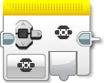
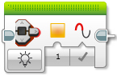
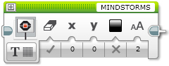
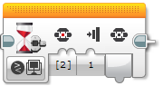
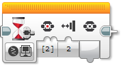

EV3 Brick
====================

EV3 Brick obsahuje několik komponent, které má uživatel k dispozici. 
V rámci C++ API lze využívat:

* ``BrickButton`` - tlačítka
* ``statusLight`` - stavová kontrolka (dvoubarevná LED)
* ``display`` - LCD displej

Inicializace
*****************

Pro využití stavové kontrolky a displej není potřeba inicializace.

Inicializace se provádí jen pro tlačítka: 

.. code-block:: cpp

    ev3cxx::BrickButton btnEnter(ev3cxx::BrickButtons::ENTER);

Vytvořili jsme objekt ``btnEnter``, který reprezentuje prostřední tlačítka na EV3 Bricku (``ENTER``).

BrickButton
*****************

EV3 Brick má šest tlačítek, které lze využít v uživatelském programu, 
pro různé nastavování a řízení průběhu programu. 

Seznam tlačítek na EV3 Bricku:

* ``LEFT`` - tlačítko  doleva
* ``RIGHT`` - tlačítko doprava 
* ``UP`` - tlačítko nahoru   
* ``DOWN`` - tlačítko dolů 
* ``ENTER`` - tlačítko uprostřed
* ``BACK`` - tlačítko zpět  

Metody dostupné ve třídě ``BrickButton``:

* ``isPressed()`` - vrací ``true`` pokud je tlačítko stisknuté 
* ``waitForPress()`` - čekání, dokud se tlačítko nestiskne
* ``waitForRelease()`` - čekání, dokud se tlačítko neuvolní
* ``waitForClick()`` - čekání na stisknutí a uvolnění tlačítka

isPressed() 
############

.. code-block:: cpp
    
    int isPressed();

Vrací ``true`` v případě, že je tlačítko stisknuté, jinak ``false``.

Příklad: ``btnEnter.isPressed();``

waitForPress() 
########################

.. code-block:: cpp
    
    void waitForPress();

Program je pozastaven, dokud nebude tlačítko stisknuté.

Příklad: ``btnEnter.waitForPress();``

waitForRelease() 
########################

.. code-block:: cpp
    
    void waitForRelease();

Program je pozastaven, dokud nebude tlačítko uvolněno.

.. warning:: 

    Nezapomínejte, že v běžném stavu může být tlačítko uvolněno.
    Volání této metody program pozastaví pouze pokud je v daný okamžik tlačítko stisknuté.

waitForClick() 
########################

.. code-block:: cpp
    
    void waitForClick();

Program je pozastaven, dokud neproběhne stisknutí a uvolnění tlačítka.

statusLight
*****************

Stavová kontrolka slouží běžně k indikaci stavu EV3 Bricku. 
Systém si sám nastavuje její stav.
V době spuštění programu je možné tento stav měnit.
Lze se přepínat mezi červenou, zelenou a oranžovou barvou.
Pro prací s kontrolkou je k dispozici funkce ``setColor()``,
která nastavuje stav kontrolky.

* ``OFF`` - vypnuto
* ``RED`` - červená barva
* ``GREEN`` - zelená barvu
* ``ORANGE`` - oranžová barva

setColor() 
###############

.. code-block:: cpp
    
    void setColor(StatusLightColor color);

Nastavuje barvu stavové kontrolky. Lze se přepínat mezi červeno, zelenou a oranžovou barvou.

Příklad: ``ev3cxx::statusLight.setColor(ev3cxx::StatusLightColor::GREEN);``

display
*****************

Objekt ``display`` slouží k vypisování textu na displej bricku.
Pro výpis se dají použít dvě velikosti písma: ``SMALL`` a ``MEDIUM``.
Na displej se vejde 8 řádků psaných fontem ``MEDIUM``, nebo 13 řádků fontem ``SMALL``.

format() 
###############

.. code-block:: cpp
    
    format(char const *pattern);
    format(int8_t line, char const *pattern);

pro výpis textu na displej slouží metoda ``format``.
Parametr ``pattern`` je text, který se má vypsat.
Volitelný parametr ``line`` říká, na který řádek displeje se má text vypsat. Text se vypíše vždy od začátku displeje a vybraný řádek je před výpisem smazán.

Příklad: ``ev3cxx::display.format("Hello world");``

Vypíše na displej text "Hello world".

Ve vypisovaném textu se mohou vyskytovat speciální znaky pro ovládání pozice kurzoru:

* ``\n`` - přesune kurzor na začátek dalšího řádku
* ``\r`` - přesune kurzor na začátek tohoto řádku

Příklad: ``ev3cxx::display.format("Ahoj svete! \nJak se mas?");``

Na prvním řádku displeje bude po provedení tohoto příkazu text "Ahoj svete!".
Na druhém řádku pak "Jak se mas?".

``format`` také umožňuje vypisovat na displej hodnotu proměnných pomocí znaku ``%``.
Lze vypisovat proměnné a řetězce.

.. warning:: 

    Pozor: znak ``%`` pro výpis proměnné vždy "sežere" znak, následující bezprostředně za ním!
    Z toho důvodu jsou v prvním příkladu s hodinami za znakem ``%`` napsány dvě mezery.
    První mezeru "sežere" ``%``, druhá se vypíše.
    Mít za ``%`` mezeru je nezbytně nutné i v případě, že je ``%`` posledním znakem v řetězci.
    Pokud za ``%`` následuje hned konec řetězce, je chování nedefinované.

    Příklad: |br|\
    ``ev3cxx::display.format("%") % 1;`` číslo "1" se na displeji nezobrazí => za % není mezera |br|\
    ``ev3cxx::display.format("% ") % 1;`` při tomto zápisu formátovacího řetězce se již číslo "1" zobrazí normálně na displej

Příklad:

   .. code-block:: cpp

      int hours = 19;
      int minutes = 42;
      ev3cxx::display.format("Je %  hodin a %  minut.") % hours % minutes;

Vypíše na displej text "Je 19 hodin a 42 minut.".

Také se dá specifikovat zarovnání výpisu proměnné doprava na daný počet znaků.
Například při výpisu hodin je dobré, když jsou hodiny i minuty vždy na stejném místě, bez ohledu na to, jestli jsou zrovna reprezentovány jednomístným, nebo dvoumístným číslem.

.. note:: 
   Zarovnání znaků je podporováno jen u celočíselných typů (``int``, ``long``, ...). Nelze jej nastavovat u čísel s plovoucí čárkou (``float`` a ``double``). U nich bude uživatelem zadané zarovnání ignorováno a použije se vždy výchozí nastavení (``float`` => ``%g`` a ``double`` => ``%f`` `dle standardní specifikace formátování čísel v C <http://www.cplusplus.com/reference/cstdio/printf/#parameters>`_).

Příklad:

   .. code-block:: cpp

      int hours = 8;
      int minutes = 42;
      ev3cxx::display.format("Je %2 hodin a %2 minut.") % hours % minutes;

Vypíše na displej text ``Je  8 hodin a 42 minut.``.
Všimněte si dvou mezer mezi "je" a "8", ale jen jedné mezery mezi "a" a "42".
8 hodin je pouze jednomístné číslo a tudíž ho formát sám doplnil zleva mezerou, aby zabíralo stejně místa, jako dvoumístné číslo a nedocházelo k posunu následujícího textu.
Zarovnání doplňuje zleva mezery, pokud je to potřeba, ale nebrání ve výpisu delších čísel.

Dále je možné vypisovat čísla v dvojkové, nebo šestnáctkové soustavě.

Příklad: ``ev3cxx::display.format("hex: %x4\nbin: %b8\ndec: %3") % 42 % 42 % 42;``

Vypíše na displej text:

.. |br| raw:: html

    

``hex: 002A`` |br|\
``bin: 00101010`` |br|\
``dec:  42``

Šestnáctková a dvojková čísla se při zarovnání doplňují číslicí 0, zatím co desítková mezerami.

Chcete-li mít ve výsledném textu znak %, použijte kombinaci ``%%``:

Příklad: ``ev3cxx::display.format("10%%");``

Vypíše na displej text "10%".

resetScreen() 
###############

.. code-block:: cpp
    
    void resetScreen(bool_t color = white);

Tato metoda smaže celý displej.
Podle parametru ``color`` může být poté celý displej buď bílý, nebo černý.
Bez parametru je výchozí stav bílý displej.

Příklad: ``ev3cxx::display.resetScreen();``

setFont() 
###############

.. code-block:: cpp
    
    void setFont(lcdfont_t font);

Tato metoda umožňuje nastavit font, kterým se bude na displej psát.
Jsou k dispozici dva fonty:

* EV3_FONT_SMALL - malý font, 13 řádků na displej
* EV3_FONT_MEDIUM - střední font, 8 řádků na displej

Příklad: ``ev3cxx::display.setFont(EV3_FONT_MEDIUM);``