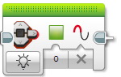

EV3 Brick
====================

EV3 Brick obsahuje několik komponent, které má uživatel k dispozici. 
V rámci C++ API lze využívat:

* ``BrickButton`` - tlačítka
* ``statusLight`` - stavová kontrolka (dvoubarevná LED)
* ``display`` - LCD displej

.. image:: images/lego-soft_brick-button-isPressed.png
   :width: 22%

Inicializace
*****************

Pro využití stavové kontrolky a displeje neni potřeba inicializace.

Inicializace se provádí jen pro tlačítka: 

.. code-block:: cpp

    ev3cxx::BrickButton btnEnter(ev3cxx::BrickButtons::ENTER);

Vytvořili jsme objekt ``btnEnter``, která je nastavena na prostřední tlačítka na EV3 Bricku (``ENTER``).

BrickButton
*****************

EV3 Brick má šest tlačítek, které lze využít v uživatelském programu, 
pro různé nastavování a řízení průběhu programu. 

Seznam tlačítek na EV3 Bricku:

* ``LEFT`` - tlačítko  doleva
* ``RIGHT`` - tlačítko dopravé 
* ``UP`` - tlačítko nahorů   
* ``DOWN`` - tlačítko dolů 
* ``ENTER`` - tlačítko v prostřed
* ``BACK`` - tlačítko zpět  

Metody dostupné ve třídě ``BrickButton``:

* ``isPressed()`` - vrací ``true`` pokud je tlačítko zmáčklý 
* ``waitForPress()`` - čekání, dokud se tlačítko nezmáčkne
* ``waitForRelease()`` - čekání, dokud se tlačítko neuvolní
* ``waitForClick()`` - čekání na zmáčknutí a uvolnění tlačítka

isPressed() 
############

.. image:: images/lego-soft_brick-button-isPressed.png
   :height: 90px

.. code-block:: cpp
    
    int isPressed();

Vrací ``true`` v případě, že je tlačítko zmáčklý, jinak ``false``.

Příklad: ``btnEnter.isPressed();``

waitForPress() 
########################

.. code-block:: cpp
    
    void waitForPress();

Program je pozastaven, dokud nebude tlačítko zmáčknutp.

Příklad: ``btnEnter.waitForPress();``

waitForRelease() 
########################

.. image:: images/lego-soft_brick-button-waitForRelease.png
   :height: 90px

.. code-block:: cpp
    
    void waitForRelease();

Program je pozastaven, dokud nebude tlačítko uvolněno.

.. warning:: 

    Nezapomínejte, že v běžném stavu může být tlačítko uvolněno.
    Volání této metody program pozastaví pouze pokud je v daný okamžik tlačítko zmáčknutý.

waitForClick() 
########################

.. image:: images/lego-soft_brick-button-waitForClick.png
   :height: 90px

.. code-block:: cpp
    
    void waitForClick();

Program je pozastaven, dokud neproběhne zmáčknutí a uvolnění tlačítka.

statusLight
*****************

Stavová kontrolka slouží běžně k indikaci stavu EV3 Bricku. 
Systém si sám nastavuje jejich stav.
V době spuštění programu je možné tento stav měnit.
Lze se přepínat mezi červenou, zelenou a oranžovou barvou.
Pro prací s kontrolkou je k dispozici funkce ``setColor()``,
která nastavuje stav kontrolky.

* ``OFF`` - vypnuto
* ``RED`` - červená barva
* ``GREEN`` - zelenou barvu
* ``ORANGE`` - oranžová barva

setColor() 
###############

.. code-block:: cpp
    
    void setColor(StatusLightColor color);

Nastavuje barvu stavové kontrolky. Lze se přepínat mezi červeno, zelenou a oranžovou barvou.

Příklad: ``ev3cxx::statusLight.setColor(ev3cxx::StatusLightColor::GREEN);``

display
*****************

format() 
###############
