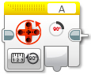

Motory
====================

Motory jsou jednou ze základních komponent robota a proto s nimi začneme. 
Nejprve je potřeba vytvořit si instanci motorů: 

.. code-block:: cpp

   ev3cxx::Motor motor(ev3cxx::MotorPort::A, ev3cxx::MotorType::LARGE);

Vytvořili jsme objekt ``motor``, který je nastaven na port ``A`` a typ ``LARGE``.

K dispozici máme všechny motorové porty na *Bricku* : ``A``, ``B``, ``C`` a ``D``. 
U typů máme 3 volby, které odpovídají stejným blokům v originálním LEGO Softwaru: ``UNREGULATED``, ``MEDIUM`` a ``LARGE``.

.. image:: images/lego-soft_motor-unregulated.png
   :width: 32%
.. image:: images/lego-soft_motor-medium.png
   :width: 32%
.. image:: images/lego-soft_motor-large.png
   :width: 32%

* neregulované motory (``UNREGULATED``): u motorů se nastavuje jen výkon, změny zatížení (jízda do kopce) budou značně ovlivňovat rychlost
* regulované motory střední a velké (``MEDIUM`` a ``LARGE``): u motorů se nastavuje rychlost a motor se tuto rychlost snaží udržovat, upravuje tak výkon v závislosti na okolním prostředí (nerovnosti, překážky, atd.)
Při inicializaci je potřeba se rozhodnout v jakém režimu budete chtít s motorem pracovat.

.. note:: Pokud nebude řečeno jinak: 
     * při zadání parametru mimo rozsah se automaticky nastavuje maximální/minimální povolená hodnota. 
     * výchozí hodnoty metod odpovídají standardním hodnotám v LEGO Softwaru. 

    Příklad: 
        Rozsah povolených hodnot je v rozmezí od -100 do 100. 
        Při zadání hodnoty -101, dojde k ořezání na hodnotu -100.
        Při zadání hodnoty 101, dojde k ořezání na hodnotu 100. 

Výkon a rychlost
*****************

.. note:: 
    Parametry při nastavování rychlosti a výkonu.

        * ``speed``: rychlost motoru při jízdě; rozsah od -100 do 100
        * ``brake``: brzdění; ``true`` - motor brzdí, ``false`` - motor lze volně protáčet

off() 
########

.. image:: images/lego-soft_motor-medium-off.png
   :height: 90px

.. code-block:: cpp
    
    void off(bool brake = true)

Metoda ``off()`` zastavuje motor. 
Nastavuje rychlost nebo výkon (v závislosti na daném režimu) na 0. 
Jako parametr se předává zda má motor zároveň brzdit (``true``) nebo se volně protáčet (``false``). 
Ve výchozím stavu brzdí (``true``). 

Použití: ``motor.off();``

on()
########

.. image:: images/lego-soft_motor-medium.png
   :height: 90px

.. code-block:: cpp
    
    void on(int power = 50)

Metoda ``on()`` nastavuje rychlost motoru. 
Jako parametr se předává požadovaná rychlost v rozsahu -100 až 100.
Ve výchozím stavu je hodnota 50. 

Použití: ``motor.on(50);``

Čas a otáčky
*************

.. note:: 
    Nové parametry při nastavování otáček.

        * ``speed``: rychlost motoru při běhu; rozsah od -100 do 100
        * ``time_ms``: čas v milisekundách, po který se bude motor točit; 
        * ``degrees``: počet stupňů, o které se má motor otočit; lze otáčet i o více než +- 360 stupňů
        * ``rotations``: počet otáček, které má motor udělat; lze zadávat i desetinná čísla
        * ``brake``: brzdění po otočení o daný počet stupňů; ``true`` - motor po dotočení brzdí, ``false`` - motor lze volně protáčet
        * ``blocking``:  když ``true`` - metoda blokuje další provádění programu, dokud nedokončí svůj úkol
        * ``wait_after_ms``:  parametr, který nastavuje čekání po ukončení dané akce (jen v případě ``blocking = true``); nechte výchozí hodnotu 

onForSeconds()
################

.. image:: images/lego-soft_motor-medium-onForSeconds.png
   :height: 90px

.. code-block:: cpp
    
    void onForSeconds(int speed = 50, 
                      unsigned int time_ms = 1000, 
                      bool brake = true) 

Metoda ``onForSeconds()`` nastavuje čas, jak dlouho se má motor točit. 
Jako parametry se předávají: ``speed``, ``time_ms``, ``brake``. 

Použití: ``motor.onForSeconds(50, 1000);``

.. note:: LEGO pracuje se sekundami a desetinnými čísly, EV3CXX používá milisekundy a celá čísla

.. warning:: Metoda je vždy blokující. Další příkazy v programu se začnou vykonávat až metoda skončí.  

onForDegrees()
################

.. image:: images/lego-soft_motor-medium-onForDegrees.png
   :height: 90px

.. code-block:: cpp
    
    void onForDegrees(int speed = 50, 
                      int degrees = 360, 
                      bool brake = true, 
                      bool blocking = true, 
                      unsigned int wait_after_ms = 60)

Metoda ``onForDegrees()`` nastavuje počet stupňů, o které se má motor otočit. 
Jedna otáčka motoru odpovídá 360 stupňům. 
Jako parametry se předávají: ``speed``, ``degrees``, ``brake``, ``blocking``, ``wait_after_ms``. 

Použití: ``motor.onForDegrees(50, 360);``

onForRotations()
##################

.. image:: images/lego-soft_motor-medium-onForRotations.png
   :height: 90px

.. code-block:: cpp
    
    void onForRotations(int speed = 50, 
                        float rotations = 1, 
                        bool brake = true, 
                        bool blocking = true, 
                        unsigned int wait_after_ms = 60)

Metoda ``onForRotations()`` nastavuje počet otáček, o které se má motor otočit. 
Jako parametry se předávají: ``speed``, ``rotations``, ``brake``, ``blocking``, ``wait_after_ms``. 

Použití: ``motor.onForRotations(50, 1);``

Poloha
**********************

degrees()
##################

.. code-block:: cpp
    
    int degrees()

Metoda ``degrees()`` vrací polohu motoru ve stupních.

Použití: ``motor.degrees();``

rotations()
##################

.. code-block:: cpp
    
    float rotations()

Metoda ``rotations()`` vrací polohu motoru v otáčkách a v desetinných číslech.

Použití: ``motor.rotations();``

resetPosition()
##################

.. code-block:: cpp
    
    void resetPosition()

Metoda ``resetPosition()`` vyresetuje pozici motoru (ovlivní metodu ``degrees()`` a ``rotations()``).

Použití: ``motor.resetPosition();``

Výkon
**********************

currentPower()
##################

.. code-block:: cpp
    
    int currentPower()

Metoda ``currentPower()`` vrací aktuální rychlost motoru. 

Použití: ``motor.currentPower();``

Dostupné metody
**********************

Po vytvoření objektu ``motor`` lze na něm volat metody:

* ``off()`` - vypne motory a začne brzdit
* ``on()`` - nastaví rychlost na motorech
* ``onForSeconds()`` - jede po zadanou dobu
* ``onForDegrees()`` - otočí se o daný počet stupňů
* ``onForRotations()`` - otočí se o daný počet otáček
* ``degrees()`` - vrátí aktuální počet stupňů na motoru
* ``rotations()`` - vrátí aktuální počet otáček na motoru
* ``currentPower()`` - vrátí aktuální rychlost motoru
* ``resetPosition()`` - vyresetuje pozici motoru (ovlivní metodu ``degrees()`` a ``rotations()``)
* ``getType()`` - vrátí aktuálně nastavený typ motoru na daném portu v systému EV3RT

