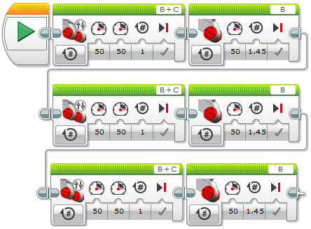

01 - trojúhelník
===================================

Prvním tvým úkolem bude naučit robota jezdit. 
Abychom nejezdili jen tak, zkusíme robota naučit jezdit ve tvaru trojúhelník.

Pro rozpohybování robota musíš použít :doc:`motor-tank-class`. 

Je potřeba poskládat příkazy pro jízdu rovně a otočení, tak aby výsledný tvar, který robot projede tvořil trojúhelník.

Aby jsi mohl použít motory v režimu tank je potřeba si vytvořit objekt ze třídy ``MotorTank``.

To lze provést následovně: 

.. code-block:: cpp
    
    ev3cxx::MotorTank motors(ev3cxx::MotorPort::B, ev3cxx::MotorPort::C);

Pro jízdu rovně zavolej funkci ``motors.onForRotations(50, 50, 1);``. 
Funkce je volána se stejnou rychlostí levého a pravého motoru (hodnota 50) a proto pojede robot rovně.
Vzdálenost kterou ujede je 1 otáčka hřídele motoru a u našeho robota i 1 otáčka kola.

Když se budeš chtít otočit, použiješ stejnou funkci, ale nastavíš jiné parametry. 
S robotem se chceš otočit na místě, tak aby jedno kolo stálo a druhé jelo. 
Tím pádem musí být rychlost motoru na jedné straně 0 a na druhé straně třeba 50.
Poslední parametr, který musíme upravit je počet otáček.
Je potřeba najít optimální číslo pro otáčku, tak abychom měli pěkný trojúhelník.
To již ale nechám na tobě. 
Vyzkoušej si různá čísla a vyber to nejvhodnější. 
Jen nezapomeň, že můžeš zadávat i desetinná čísla (s desetinnou tečkou: `1.5`).

Pokud máš tyto dva příkazy napsané, stačí už je jen dvakrát rozkopírovat a odzkoušet.
Jestli nebudeš mít úplně přesný trojúhelník, nic se neděje. 
Zkus si ještě pohrát s počtem otáček.

A to je v tomto úkolu vše. 
Pro inspiraci se můžeš podívat jak by program vypadal v LEGO Softwaru a níže najdeš ukázkovou verzi programu.

.. literalinclude:: 01-triangle/app.cpp
   :language: cpp

