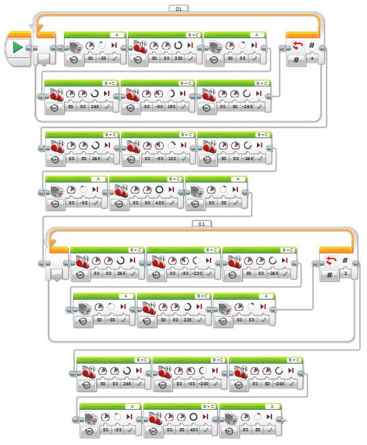

03 - malujeme dům
===================================

Ve třetím úkolu nebudeme jen jezdit, ale zkusíme i kreslit. 
Takže papír, tužku, izolepu a jdeme kreslit.
Zkusíme si robotem nakreslit dům. 
Pro kreslení je asi nejvhodnější fix a k robotovy ji můžeme přidělat pomocí izolepy na přední packu.
Pamatuj na to, že střed robota není střed fixe. 
S tímto musí váš program počítat.

Tento program je již složitější a rozsáhlejší, tak se zkus inspirovat třeba diagramy z LEGO Softwaru.

.. literalinclude:: 03-draw_house/app.cpp
   :language: cpp

