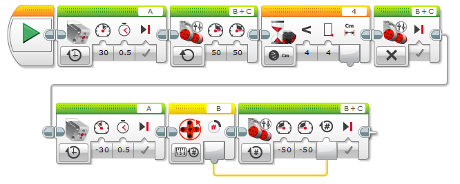

04 - chytit a vrátit
===================================

Ve čtvrtém úkolu zkusíme poprvé použít senzor. 
Cílem je dojet pro barevnou kostku, kterou jsi si měl složit s Education robotem. 
Chytit ji pomocí robotické ruky a vrátit se na místo, odkud jsi vyjel.
Tento úkol není tak složitý, tak nad ním zkus zapřemýšlet.
Potřebuješ použít ultrazvuk, který máš na svém robotovi a vše ostatní již znáš.

.. literalinclude:: 04-catch_and_return/app.cpp
   :language: cpp

