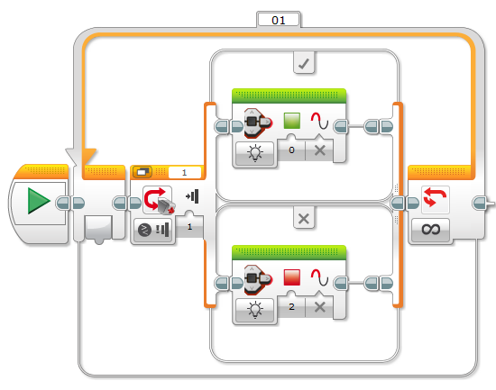

05 - zmáčkni a sviť
===================================

V rámci pátého úkolu si vyzkoušíme pracovat s LED na Bricku a budeme je ovládat pomocí Touch senzoru.
Také si poprvé vyzkoušíme poprvé použít podmínku. 
Již jsme s ní pracovali v rámci cyklu, takže by to neměl být žádný problém.

.. literalinclude:: 05-switch/app.cpp
   :language: cpp

V následujícím úkole se můžeš těšit na jízdu po čáře.
