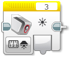
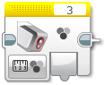
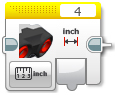
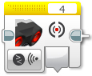

Senzory
====================

Když už umíme ovládat motory, měli bychom se naučit pracovat se senzory.
Pomocí senzorů můžeme získávat informace z okolí a reagovat na ně.
Lze tak třeba řídit rychlost motorů, podle pozice robota na čáře nebo zastavit robota před překážkou.
V EV3CXX jsou k dispozici všechny základní senzory z LEGO MINDSTORMS EV3.

* ``TouchSensor`` - dotykový senzor (detekce nárazu, překážky, STOP tlačítko)
* ``ColorSensor`` - barevný senzor (jízda po čáře, třídění dle barvy)
* ``UltrasonicSensor`` - ultrazvukový senzor (měření vzdálenosti od překážky nebo mantinelu)
* ``GyroSensor`` - gyro senzor (určení o kolik stupňů se robot otočil - jízda rovně)

.. image:: images/lego-soft_sensor-touch-state.png
   :width: 24%
.. image:: images/lego-soft_sensor-color-getReflected.png
   :width: 24%
.. image:: images/lego-soft_sensor-ultrasonic-centimetres.png
   :width: 24%
.. image:: images/lego-soft_sensor-gyro-angle.png
   :width: 24%

Inicializace
*****************

Všechny senzory se inicializují: 

.. code-block:: cpp

    //ev3cxx::nazev_tridy_senzoru nazev_objektu(ev3cxx::SensorPort::cislo_portu);
    ev3cxx::TouchSensor touchS(ev3cxx::SensorPort::1);

Vytvořili jsme tedy objekt ``touchS``, která je nastavena na port číslo ``1``.

Na *Bricku* můžeme využít všechny porty pro senzory: ``1``, ``2``, ``3`` a ``4``. 

TouchSensor
*****************

Metody dostupné ve třídě ``TouchSensor``:

* ``isPressed()`` - vrací ``true`` pokud je senzor zmáčklý 
* ``waitForPress()`` - čekání, dokud se senzor nezmáčkne
* ``waitForRelease()`` - čekání, dokud se senzor neuvolní
* ``waitForClick()`` - čekání na zmáčknutí a uvolnění senzoru

isPressed() 
############

.. image:: images/lego-soft_sensor-touch-state.png
   :height: 90px

.. code-block:: cpp
    
    int isPressed();

Vrací ``true`` v případě, že je dotykový senzor zmáčknut, jinak ``false``.

void waitForPress() 
########################

.. image:: images/lego-soft_sensor-touch-waitForPress.png
   :height: 90px

.. code-block:: cpp
    
    void waitForPress();

Program je pozastaven, dokud nebude dotykový senzor zmáčknut.

void waitForRelease() 
########################

.. image:: images/lego-soft_sensor-touch-waitForRelease.png
   :height: 90px

.. code-block:: cpp
    
    void waitForRelease();

Program je pozastaven, dokud nebude dotykový senzor uvolněn.

.. warning:: 

    Nezapomínejte, že v běžném stavu je dotykový senzor uvolněn a proto nemusí být program při volání této funkce vůbec pozastaven. 
    Je tedy nutné nejprve dotykový senzor zmáčknout a až potom volat tuto funkci.

void waitForClick() 
########################

.. image:: images/lego-soft_sensor-touch-waitForClick.png
   :height: 90px

.. code-block:: cpp
    
    void waitForClick();

Program je pozastaven, dokud neproběhne zmáčknutí a uvolnění dotykového senzoru.

ColorSensor
*****************

Barevný senzor může pracovat v několika režimech: 

* ``getReflected()`` - vrací naměřenou intenzitu odrazu
* ``getReflectedRawRgb()`` - vrací naměřenou intenzitu odrazu pro jednotlivé barevní složky (RGB - červená, zelená, modrá)
* ``getAmbient()`` - vrací naměřenou intenzitu odrazu bez přisvětlení (vhodné pro kalibraci)
* ``getColor()`` - vrací rozpoznanou barvu

getReflected() 
###############

.. image:: images/lego-soft_sensor-color-getReflected.png
   :height: 90px

.. code-block:: cpp
    
    int getReflected();

Vrací naměřenou intenzitu odraženého světla z povrchu.
Lze tak rozpoznat barvu povrchu a například tak detekovat černo čáru na bílém podkladu.

Rozsah výstupních hodnot je od 0 do 100.

.. note::
    Senzor si při své činnosti snímanou plochu přisvětluje vlastními světly, tak aby mohl lépe určit odrazivost povrchu a nebyl tolik závislý na okolním osvětlení.
    Přes funkci ``getAmbient()`` je možné určit odrazivost při vypnutém přisvětlení.
    Po odečtení této hodnoty od ``getReflected()``  by měli být hodnoty za různých světelných podmínek pro stejné povrchy konstantní. 

getReflectedRawRgb() 
#####################

.. code-block:: cpp
    
    rgb_raw_t getReflectedRawRgb();

Vrací strukturu s naměřenými hodnotami jednotlivých barevných složek. 

.. note:: Tato funkce nemá odpovídající blok v LEGO Softwaru. 

Příklad:

    .. code-block:: cpp
        
        rgb_raw_t rgb_values;
        rgb_values = colorS.getReflectedRawRgb();
        
        rgb_values.r; // RED value

getAmbient() 
#####################

.. code-block:: cpp
    
    int getAmbient();

Vrací naměřenou intenzitu odraženého světla od povrchu, ale **bez přisvětlení vlastními světly**.
Vhodné pro kalibraci senzoru pro různá osvětlení. Více informací v poznámce u funkce ``getReflected()``.

Rozsah výstupních hodnot je od 0 do 100.

getColor() 
#####################

.. code-block:: cpp
    
    colorid_t getColor();

Vrací rozpoznanou barvu povrchu z výčtového typu ``enum colorid_t``.

Hodnoty v typu ``colorid_t``:

*  ``COLOR_NONE`` - barva nerozpoznána 
*  ``COLOR_BLACK`` - černá barva  
*  ``COLOR_BLUE``  - modrá barva 
*  ``COLOR_GREEN`` - zelená barva  
*  ``COLOR_YELLOW`` - žlutá barva  
*  ``COLOR_RED`` - červená barva  
*  ``COLOR_WHITE`` - bílá barva    
*  ``COLOR_BROWN`` - hnědá barva  

Příklad:

    .. code-block:: cpp
        
        colorid_t color_value;
        color_value = colorS.getColor();
        
        if (color_value == COLOR_BLACK) 
        {
             // senzor on black color
        }

UltrasonicSensor
*****************

ultrazvukový senzor je primárně určen na měření vzdálenosti. Můžeme jej využít pro detekci překážky, určení vzdálenosti od mantinelu nebo i pro korekci jízdy. 

.. note:: Šíření ultrazvukových vln v prostoru

    .. figure:: images/Ultrasonic-measure-range.jpg
       :height: 286px
       :align: center

       Ultrazvukové vlny se od vysílače šíří v kuželu.
       To znamená, že s rostoucí vzdáleností ultrazvuk pokrývají větší plochu. 
       Zároveň s tím ale klesá jeho rozlišovací schopnost, proto při větších vzdálenostech nedokáže zachytit předměty, které na blízko zachytí.
       To je podstatný rozdíl v porovnání s infra senzorem, jehož paprsky se šíří prakticky přímo (s mnohem menším rozptylem do stran).

       Zdroj obrázku: http://arcbotics.com/products/sparki/parts/ultrasonic-range-finder/

Ultrazvuk v EV3CXX poskytuje tyto funkce:

* ``centimeters()`` - vrací naměřenou vzdálenost v centimetrech
* ``millimeters()`` - vrací naměřenou vzdálenost v milimetrech
* ``inches()`` - vrací naměřenou vzdálenost v palcích
* ``inchesLine()`` - vrací naměřenou vzdálenost v line (1/12 palce)
* ``listen()`` - vrací zda přijímá signal z jiného ultrazvukového vysílače

.. warning:: 
   Ultrazvuk v EV3 umí měřit v rozsahu od 3 do 255 centimetrů. 
   Pokud se budete pohybovat na hranici 3 centimetrů, může se stát, že ultrazvuk nedokáže danou vzdálenost změřit a místo hodnoty blízké 3 cm vrátí hodnotu rovnou maximální vzdálenosti => 255 cm.
   
   Pamatujte na tuto vlastnosti při návrhu a programování vašich robotů. Nejbezpečnějším řešením je umístit ultrazvuk tak, aby samotná konstrukce nedovolila menší vzdálenost než 4 a více centimetrů.

centimeters() 
###############

.. image:: images/lego-soft_sensor-ultrasonic-centimetres.png
   :height: 90px

.. code-block:: cpp
    
    int centimeters();

Vrací naměřenou vzdálenost v centimetrech. 

Rozsah měření je od 3 do 255.

.. warning:: 
   Na rozdíl od LEGO Softwaru, v EV3CXX tato funkce pracuje v celých číslech. Pokud chcete vyšší přesnost použijte funkci ``millimeters()``.

millimeters() 
###############

.. code-block:: cpp
    
    int millimeters();

Vrací naměřenou vzdálenost v milimetrech. 

Rozsah měření je od 30 do 2550.

.. note:: 
   Tato funkce nemá odpovídající blok v LEGO Softwaru. 
   Jelikož ultrazvuk v EV3 má rozlišení na milimetry a v LEGO Softwaru to řeší pomocí desetinných čísel, je v EV3CXX implementována tato funkce.

inches() 
###############

.. code-block:: cpp
    
    int inches();

Vrací naměřenou vzdálenost v palcích (1 palec = 2,54 cm). 

Rozsah měření je od 1 do 100.

.. warning:: 
   Na rozdíl od LEGO Softwaru, v EV3CXX tato funkce pracuje v celých číslech. Pokud chcete vyšší přesnost použijte funkci ``inchesLine()``.

inchesLine() 
###############

.. code-block:: cpp
    
    int inchesLine();

Vrací naměřenou vzdálenost v linech (1 line = 1/12 palce). 

Rozsah měření je od 10 do 1200.

.. note:: 
   Tato funkce nemá odpovídající blok v LEGO Softwaru. 
   Jelikož ultrazvuk v EV3 má rozlišení na milimetry a v LEGO Softwaru to řeší pomocí desetinných čísel, je v EV3CXX implementována tato funkce.

listen() 
###############

.. code-block:: cpp
    
    int listen();

Senzor poslouchá a pokud zachytí ultrazvukový signál, od jiného vysílače, vrací ``true``, jinak ``false``.
