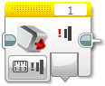
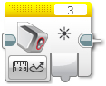
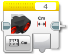
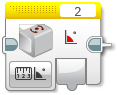
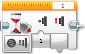
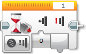
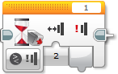

Senzory
====================

Když už umíme ovládat motory, můžeme se naučit pracovat se senzory.
Pomocí senzorů můžeme získavat informace z okolí a reagovat na ně.
Lze tak třeba řídit rychlost motorů, podle pozice robota na čáře nebo zastavit robota před překážkou.
V EV3CXX jsou k dispozici všechny základní senzory z LEGO MINDSTORMS EV3.

* ``TouchSensor`` - dotykový senzory (detekce nárazu, překážky, STOP tlačítko)
* ``ColorSensor`` - barevný senzor (jízda po čáře, třídění dle barvy)
* ``UltrasonicSensor`` - ultrazvukový senzor (měření vzdálenosti od překážky nebo mantinelu)
* ``GyroSensor`` - gyro senzor (určení o kolik stupňů se robot otočil - jízda rovně)

Inicializace
*****************

Všechny senzory se inicializují 

.. code-block:: cpp

    //ev3cxx::nazev_tridy_senzoru nazev_objektu(ev3cxx::SensorPort::cislo_portu);
    ev3cxx::TouchSensor touchS(ev3cxx::SensorPort::1);

Vytvořili jsme tedy objekt ``touchS``, která je nastavena na port číslo ``1``.

Na *Bricku* můžeme využít všechny porty pro senzory: ``1``, ``2``, ``3`` a ``4``. 

TouchSensor
*****************

Po vytvoření objetku touchS, lze na něm volat následující metody.

isPressed() 
############

.. code-block:: cpp
    
    int isPressed();

Vrací ``true`` v přípádě, že je dotykový senzor zmáčnut, jinak ``false``.

void waitForPress() 
########################

.. code-block:: cpp
    
    void waitForPress();

Program je pozastaven, dokud nebude zmáčknuto tlačítko.

void waitForRelease() 
########################

.. code-block:: cpp
    
    void waitForRelease();

Program je pozastaven, dokud nebude uvolněno tlačítko.

.. warning:: 

    Nezapomínejte, že v běžném stavu je tlačítko uvolněno a proto nemusí být program při volání této funkce vůbec pozastaven.

void waitForClick() 
########################

.. code-block:: cpp
    
    void waitForClick();

Program je pozastaven, dokud neproběhne zmáčnutí a uvolnění tlačítka.