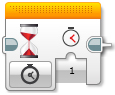

Čas
====================

Pro práci s časem je v EV3CXX k dispozici:

* ``wait()`` - čekání v milisekundách
* ``StopWatch`` - třída pro práci se stopkama, umožňuje měření a časování

Čekání
*****************

Pro čekání v programu (pozastavení vykonávání) je v EV3CXX k dispozici funkce ``wait()``.

void wait()
##################

.. code-block:: cpp
    
    void wait(unsigned int time_ms);

Funkce pozastaví vykonávání programu na zadaný počet milisekund. 

.. note:: 
   Nezapomeňte u funkce uvést namespace ``ev3cxx``.

   Příklad čekání jednu sekundu: ``ev3cxx::wait(1000);``  
    
Měření a časování
******************

Pro odměřování času v EV3CXX slouží třída ``StopWatch``.

.. code-block:: cpp
    
    StopWatch stopky;

.. note:: 
   Po vytvoření objektu ``StopWatch`` se automaticky spouští stopky/měření. 
   Pokud si chcete odstartovat měření sami až v průběhu programu, stáčí předat při vytváření objektu hodnoty ``false``.
   
   Příklad: ``StopWatch stopky(false);`` 

isRunning()
##################

.. code-block:: cpp
    
    bool isRunning();

Vrátí ``true`` pokud časovač běží. 

