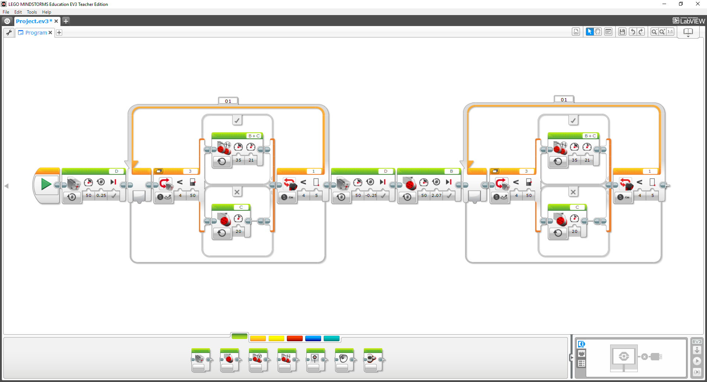

.. Read the Docs Template documentation master file, created by
   sphinx-quickstart on Tue Aug 26 14:19:49 2014.
   You can adapt this file completely to your liking, but it should at least
   contain the root `toctree` directive.

Dokumentace k EV3RT CXX API!
==================================================

EV3RT CXX API vzniklo jako C++ nástavba EV3RT C API (ev3api), které je standardní součástí systému EV3RT_. 

Systém EV3RT vznikl jako port japonského real-time operačního systém `TOPPERS/HRP2 <http://www.toppers.jp/hrp2-kernel.html>`_ pro stavebnici `LEGO MINDSTORMS EV3 <https://www.lego.com/cs-cz/mindstorms/about-ev3>`_. 

Mezi hlavní přednosti systéme EV3RT patří:
 * malá velikost systému (do 5 MB) i uživatelských aplikací (do 1 MB)
 * velmi rychlí start (do 5 sekund) a vypnutí prakticky okamžitě
 * jednodušší úprava a doprogramování vlastních funkcí do jádra systému
 * podpora dynamické alokace
 * preemptivní multitasking a rychlí přepínání tasků (do 8 μs)
 * multiplatformní

Hlavním cílem EV3RT CXX API je umožnit jednoduchý přechod uživatelům zvyklým na standardní LEGO vývojové prostředí (`LEGO MINDSTORMS EV3 Software <https://www.lego.com/cs-cz/mindstorms/downloads/download-software>`_) Proto jim je celé API přizpůsobeno a většina funkcí se jmenuje a chová stejně jako v originální vývojovém prostředí.

    
    
.. _EV3RT: http://ev3rt-git.github.io/

Contents:

.. toctree::
   :maxdepth: 2
   :glob:

    motor-class
   *

Indices and tables
==================

* :ref:`genindex`
* :ref:`modindex`
* :ref:`search`

