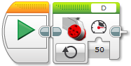

# Test markdown

## Test 2 markdown

Motory jsou jedna z nejzákladnějších komponent robota a proto s nimi začneme.

```cpp
   ev3cxx::Motor motor(ev3cxx::MotorPort::A, ev3cxx::MotorType::LARGE)
```   

  

Why are not this pictures in the PDF?

 


 

