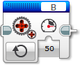
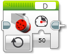
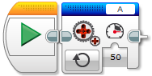
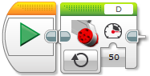

Motory
====================

Motory jsou jedna z nejzákladnějších komponent robota a proto s nimi začneme.

.. code-block:: cpp
   :linenos:

   ev3cxx::Motor motor(ev3cxx::MotorPort::A, ev3cxx::MotorType::LARGE);
   
Nejprve je potřeba vytvořit si instanci motorů: 

.. literalinclude:: excode/motor-init.cpp
   :language: cpp

Vytvořil se objekt ``motor``, který je nastaven na port ``A`` a na typ ``LARGE``.

Pokus na druho

LEGO poskytuje dva způsoby obsluhy motorů. 
Lze řídit čistě výkon motorů (neregulované/modré motory v LEGO Softwaru) a nebo můžete nastavovat rychlost (zelené motory).

.. image:: images/lego-soft_motor-unregulated.png
   :width: 25%
.. image:: images/lego-soft_motor-regulated.png
   :width: 25%

Po vytvoření objektu ``motor`` na něm lze volat funkce. Pro nastavení neregulovaného motoru je potřeba zavolat na objekt funkci ``unregulated(int power)``.

.. code-block:: cpp

   motor.unregulated(50);

Test

