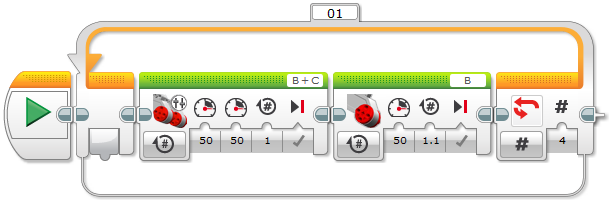

Robotutoriál - 02 - čtverec
===================================

Prvním tvým úkolem bylo naučit robota jezdit ve tvaru trojúhelníků.
Teď si zkusíme udělat podobný úkol se čtvercem. 
Říkáš, že je to skoro to samí? Ano, to máš pravdu. 
My si ale tentokrát práci trochu usnadníme.

Místo kopírování kódu použijeme cyklus. 
Cyklus za nás provede opakování kódu sám, bez toho abychom jej museli kamkoliv kopírovat.

.. literalinclude:: ev3cxx_robotutorial/02-square/app.cpp
   :language: cpp

