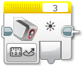

Senzory
====================

Když už umíme ovládat motory, můžeme se naučit pracovat se senzory.
Pomocí senzorů můžeme získavat informace z okolí a reagovat na ně.
Lze tak třeba řídit rychlost motorů, podle pozice robota na čáře nebo zastavit robota před překážkou.
V EV3CXX jsou k dispozici všechny základní senzory z LEGO MINDSTORMS EV3.

* ``TouchSensor`` - dotykový senzory (detekce nárazu, překážky, STOP tlačítko)
* ``ColorSensor`` - barevný senzor (jízda po čáře, třídění dle barvy)
* ``UltrasonicSensor`` - ultrazvukový senzor (měření vzdálenosti od překážky nebo mantinelu)
* ``GyroSensor`` - gyro senzor (určení o kolik stupňů se robot otočil - jízda rovně)

.. image:: images/lego-soft_sensor-touch-state.png
   :width: 24%

.. image:: images/lego-soft_sensor-ultrasonic-centimetres.png
   :width: 24%
.. image:: images/lego-soft_sensor-gyro-angle.png
   :width: 24%

Inicializace
*****************

Všechny senzory se inicializují 

.. code-block:: cpp

    //ev3cxx::nazev_tridy_senzoru nazev_objektu(ev3cxx::SensorPort::cislo_portu);
    ev3cxx::TouchSensor touchS(ev3cxx::SensorPort::1);

Vytvořili jsme tedy objekt ``touchS``, která je nastavena na port číslo ``1``.

Na *Bricku* můžeme využít všechny porty pro senzory: ``1``, ``2``, ``3`` a ``4``. 

TouchSensor
*****************

Po vytvoření objetku touchS, lze na něm volat následující metody.

isPressed() 
############

.. image:: images/lego-soft_sensor-touch-state.png
   :height: 90px

.. code-block:: cpp
    
    int isPressed();

Vrací ``true`` v přípádě, že je dotykový senzor zmáčnut, jinak ``false``.

void waitForPress() 
########################

.. code-block:: cpp
    
    void waitForPress();

Program je pozastaven, dokud nebude zmáčknuto tlačítko.

off() 
########

.. image:: images/lego-soft_motor-medium-off.png
   :height: 90px

.. code-block:: cpp
    
    void off(bool brake = true)

Funkce ``off()`` zastevuje motor. 
Nastavuje rychlost nebo výkon (v závislosti na daném režimu) na 0. 
Jako parametr se předává zda má motor zároveň brzdit (``true``) nebo se volně protáčet (``false``). 
Ve výchozím stavu brzdí (``false``). 

on()
########

.. image:: images/lego-soft_motor-medium.png
   :height: 90px

.. code-block:: cpp
    
    void on(int power = 50)

Funkce ``on()`` nastavuje rychlost motoru. 
Jako parametr se předává požadovaná rychlost v rozsahu -100 až 100.
Ve výchozím stavu je hodnota 50. 

